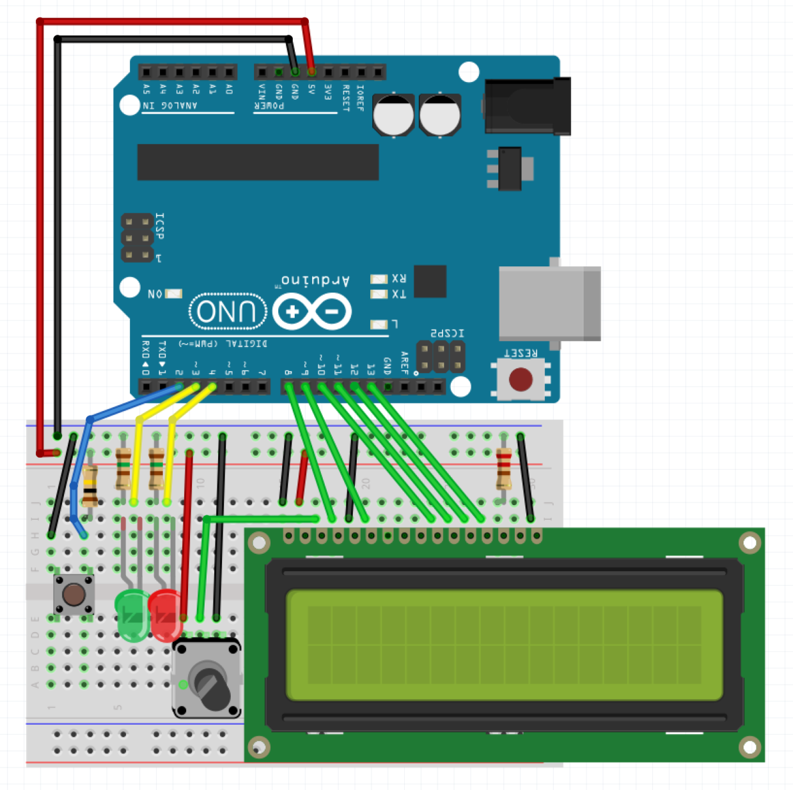

# Morse Code Interpreter 

Morse Code Interpreter is an Arduino project. It interpretes morse code into readable characters.

## Requirements

### Software

Building and uploading the Morse Code Interpreter requires Arduino IDE (see [www.arduino.cc](https://www.arduino.cc/)).

### Hardware

Here the Arduino circuit plan:

## License

Distributed under the [Apache License, Version 2.0](http://www.apache.org/licenses/). See [`LICENSE`](LICENSE) for more information.
